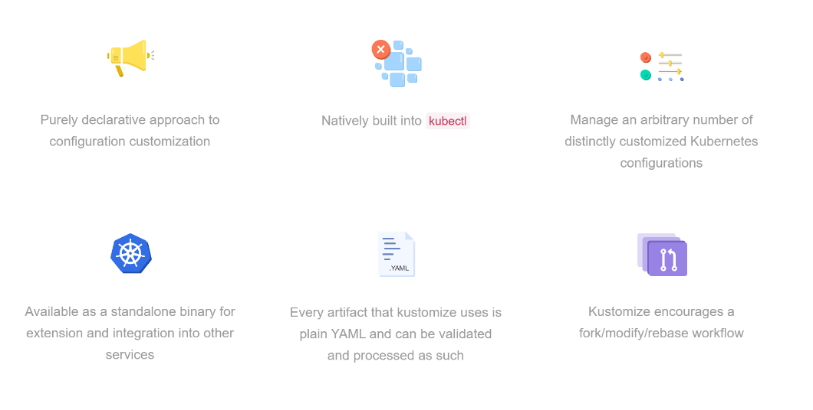
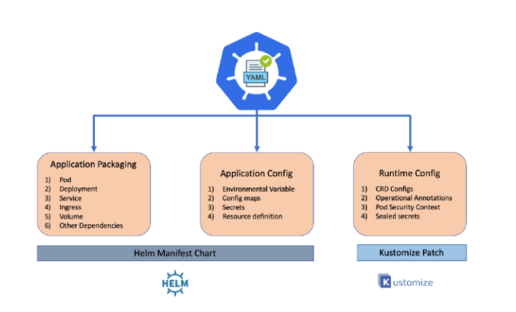
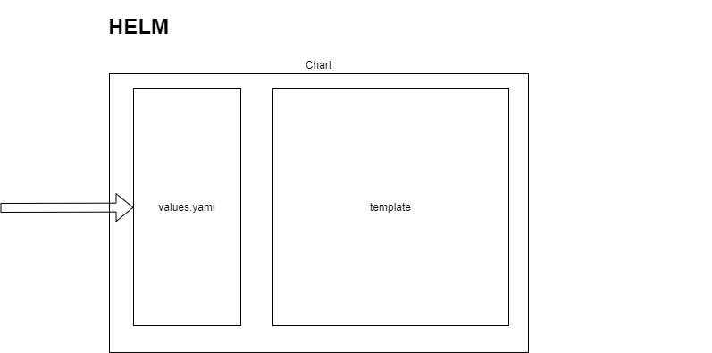
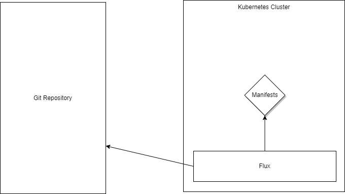

```

                             .°*oo**oo*°                    
                      °****oOOOOooOOOoOOOO.                 
                    *OoOOOO#ooO*O#OO@#*ooO@.                
                   °#.oOoOOoOOOOOoOO@#°oo*#@                
                   °O*O#O@#oOOOo**°°@°°@**OO@*              
                  .O°°#Oo°          @##@@ooOo@*             
                  @o*O##°   ........o@o*#@OoOo@.            
                  ##o@oO.   ........**oo*o@@*o@@            
                  #@o#**   ....    .***oo*@#.*o@#           
                 °@*Oooo°.     .°°°*oOo***o@**Oo@*          
                 O@@@@@@@@@O#O#@@@@@@@@@@@#@o*OOo@          
                 .@@oOOO@@@@o@@°*o##o*°@O#@@@OOOOO          
                 °@@*.....@* .@° .... *#***@Ooo°@°          
                 .#@#°°.°OO..°.@o.°°°**.*oo@*o@*#o          
                  *@...**@##@#ooo*..°.  .oo@@@o#O           
                   #.°°°   °o    .°.  . .oo#@oO°            
                   #°°***oo*********° ..*oo@@*#             
                   @° ...*ooo*°°°°.....°ooO@o.              
                   #@  ..       .  .   °O#@#                
                    ##o    ...   .. .°o@@@o                 
                     .O@O*°...°*#@OO@@@#o*                  
                        o#@@@@#O°. **.                      

                       ___               ___  
                      (o o)             (o o) 
                     (  V  ) Dag König (  V  )
                     --m-m---------------m-m--

``` 
> Note: <br/>
> You can find everything I do here in this repository:
>https://github.com/buzzfrog/kustomize-presentation


```
 ▄▄▄▄▄▄▄ ▄▄▄▄▄▄▄ ▄▄▄▄▄▄▄ ▄▄    ▄ ▄▄▄▄▄▄  ▄▄▄▄▄▄ 
█       █       █       █  █  █ █      ██      █
█   ▄   █   ▄▄▄▄█    ▄▄▄█   █▄█ █  ▄    █  ▄   █
█  █▄█  █  █  ▄▄█   █▄▄▄█       █ █ █   █ █▄█  █
█       █  █ █  █    ▄▄▄█  ▄    █ █▄█   █      █
█   ▄   █  █▄▄█ █   █▄▄▄█ █ █   █       █  ▄   █
█▄▄█ █▄▄█▄▄▄▄▄▄▄█▄▄▄▄▄▄▄█▄█  █▄▄█▄▄▄▄▄▄██▄█ █▄▄█
```
* Motivation
* What is Kustomize?
* Demo Kustomize
* Helm vs. Kustomize?!
* Demo Kustomize with GitOps (Flux)
<br/>
<br/>
<br/>
<br/>
<br/>
<br/>
<br/>
<br/>
<br/>
<br/>
<br/>
<br/>
<br/>
<br/>
<br/>
<br/>
<br/>
<br/>
<br/>
<br/>
<br/>
## Warning: This is not an introduction to Kubernetes. You probably need at least a basic understanding of that tool.
...
<br/>
<br/>
<br/>
<br/>
<br/>
<br/>
<br/>
<br/>
<br/>
<br/>
<br/>
<br/>
<br/>
<br/>
<br/>
<br/>
<br/>
<br/>
<br/>
```
 ▄▄   ▄▄ ▄▄▄▄▄▄▄ ▄▄▄▄▄▄▄ ▄▄▄ ▄▄   ▄▄ ▄▄▄▄▄▄ ▄▄▄▄▄▄▄ ▄▄▄ ▄▄▄▄▄▄▄ ▄▄    ▄ 
█  █▄█  █       █       █   █  █ █  █      █       █   █       █  █  █ █
█       █   ▄   █▄     ▄█   █  █▄█  █  ▄   █▄     ▄█   █   ▄   █   █▄█ █
█       █  █ █  █ █   █ █   █       █ █▄█  █ █   █ █   █  █ █  █       █
█       █  █▄█  █ █   █ █   █       █      █ █   █ █   █  █▄█  █  ▄    █
█ ██▄██ █       █ █   █ █   ██     ██  ▄   █ █   █ █   █       █ █ █   █
█▄█   █▄█▄▄▄▄▄▄▄█ █▄▄▄█ █▄▄▄█ █▄▄▄█ █▄█ █▄▄█ █▄▄▄█ █▄▄▄█▄▄▄▄▄▄▄█▄█  █▄▄█
```
* Kubernetes on the Edge (stretch: in a disconnected scenario.)
* GitOps / Flux
* Repository structure that manage workloads and clusters (and more)
* This tool can help you in all kubernetes engagements where you need to deploy and manage more 
  complex workloads.
  * It can be how to separate Dev/Test/Prod environment
  * When you want to use Azure Arc Flux extension
<br/>
<br/>
<br/>
<br/>
<br/>
<br/>
<br/>
<br/>
<br/>
<br/>
<br/>
<br/>
<br/>
<br/>
<br/>
<br/>
<br/>
<br/>
<br/>
<br/>
<br/>
<br/>
```
 ▄     ▄ ▄▄   ▄▄ ▄▄▄▄▄▄ ▄▄▄▄▄▄▄    ▄▄▄ ▄▄▄▄▄▄▄    ▄▄▄   ▄ ▄▄   ▄▄ ▄▄▄▄▄▄▄ ▄▄▄▄▄▄▄ ▄▄▄▄▄▄▄ ▄▄   ▄▄ ▄▄▄ ▄▄▄▄▄▄▄ ▄▄▄▄▄▄▄ ▄▄▄▄▄▄  
█ █ ▄ █ █  █ █  █      █       █  █   █       █  █   █ █ █  █ █  █       █       █       █  █▄█  █   █       █       █      █ 
█ ██ ██ █  █▄█  █  ▄   █▄     ▄█  █   █  ▄▄▄▄▄█  █   █▄█ █  █ █  █  ▄▄▄▄▄█▄     ▄█   ▄   █       █   █▄▄▄▄   █    ▄▄▄█▄▄▄   █ 
█       █       █ █▄█  █ █   █    █   █ █▄▄▄▄▄   █      ▄█  █▄█  █ █▄▄▄▄▄  █   █ █  █ █  █       █   █▄▄▄▄█  █   █▄▄▄  ▄▄█  █ 
█       █   ▄   █      █ █   █    █   █▄▄▄▄▄  █  █     █▄█       █▄▄▄▄▄  █ █   █ █  █▄█  █       █   █ ▄▄▄▄▄▄█    ▄▄▄██▄▄▄▄▄█ 
█   ▄   █  █ █  █  ▄   █ █   █    █   █▄▄▄▄▄█ █  █    ▄  █       █▄▄▄▄▄█ █ █   █ █       █ ██▄██ █   █ █▄▄▄▄▄█   █▄▄▄   ▄▄    
█▄▄█ █▄▄█▄▄█ █▄▄█▄█ █▄▄█ █▄▄▄█    █▄▄▄█▄▄▄▄▄▄▄█  █▄▄▄█ █▄█▄▄▄▄▄▄▄█▄▄▄▄▄▄▄█ █▄▄▄█ █▄▄▄▄▄▄▄█▄█   █▄█▄▄▄█▄▄▄▄▄▄▄█▄▄▄▄▄▄▄█ █▄▄█ 
```  

<br/>
<br/>
<br/>
<br/>
<br/>
<br/>
<br/>
<br/>
<br/>
<br/>
<br/>
<br/>
<br/>
<br/>
<br/>
<br/>
<br/>
<br/>
<br/>
<br/>
<br/>
<br/>
```
 ▄▄   ▄▄ ▄▄▄▄▄▄▄ ▄▄▄     ▄▄   ▄▄    ▄▄   ▄▄ ▄▄▄▄▄▄▄         ▄▄▄   ▄ ▄▄   ▄▄ ▄▄▄▄▄▄▄ ▄▄▄▄▄▄▄ ▄▄▄▄▄▄▄ ▄▄   ▄▄ ▄▄▄ ▄▄▄▄▄▄▄ ▄▄▄▄▄▄▄ 
█  █ █  █       █   █   █  █▄█  █  █  █ █  █       █       █   █ █ █  █ █  █       █       █       █  █▄█  █   █       █       █
█  █▄█  █    ▄▄▄█   █   █       █  █  █▄█  █  ▄▄▄▄▄█       █   █▄█ █  █ █  █  ▄▄▄▄▄█▄     ▄█   ▄   █       █   █▄▄▄▄   █    ▄▄▄█
█       █   █▄▄▄█   █   █       █  █       █ █▄▄▄▄▄        █      ▄█  █▄█  █ █▄▄▄▄▄  █   █ █  █ █  █       █   █▄▄▄▄█  █   █▄▄▄ 
█   ▄   █    ▄▄▄█   █▄▄▄█       █  █       █▄▄▄▄▄  █▄▄▄    █     █▄█       █▄▄▄▄▄  █ █   █ █  █▄█  █       █   █ ▄▄▄▄▄▄█    ▄▄▄█
█  █ █  █   █▄▄▄█       █ ██▄██ █   █     █ ▄▄▄▄▄█ █   █   █    ▄  █       █▄▄▄▄▄█ █ █   █ █       █ ██▄██ █   █ █▄▄▄▄▄█   █▄▄▄ 
█▄▄█ █▄▄█▄▄▄▄▄▄▄█▄▄▄▄▄▄▄█▄█   █▄█    █▄▄▄█ █▄▄▄▄▄▄▄█▄▄▄█   █▄▄▄█ █▄█▄▄▄▄▄▄▄█▄▄▄▄▄▄▄█ █▄▄▄█ █▄▄▄▄▄▄▄█▄█   █▄█▄▄▄█▄▄▄▄▄▄▄█▄▄▄▄▄▄▄█
```
* Kustomize has not [a great built in support](https://kubectl.docs.kubernetes.io/references/kustomize/kustomization/helmcharts/) for Helm

<br/>
<br/>
<br/>
<br/>
<br/>
<br/>
<br/>
<br/>
<br/>
<br/>
<br/>
<br/>
<br/>
<br/>
<br/>
<br/>
<br/>
<br/>
<br/>
<br/>
<br/>
<br/>


<br/>
<br/>
<br/>
<br/>
<br/>
<br/>
<br/>
<br/>
<br/>
<br/>
<br/>
<br/>
<br/>
<br/>
<br/>
<br/>
<br/>
<br/>
<br/>
<br/>
<br/>
<br/>
```
 ▄▄▄▄▄▄▄ ▄▄▄ ▄▄▄▄▄▄▄ ▄▄▄▄▄▄▄ ▄▄▄▄▄▄▄ ▄▄▄▄▄▄▄    ▄     ▄ ▄▄▄ ▄▄▄▄▄▄▄ ▄▄   ▄▄    ▄▄▄▄▄▄▄ ▄▄▄     ▄▄   ▄▄ ▄▄   ▄▄ 
█       █   █       █       █       █       █  █ █ ▄ █ █   █       █  █ █  █  █       █   █   █  █ █  █  █▄█  █
█   ▄▄▄▄█   █▄     ▄█   ▄   █    ▄  █  ▄▄▄▄▄█  █ ██ ██ █   █▄     ▄█  █▄█  █  █    ▄▄▄█   █   █  █ █  █       █
█  █  ▄▄█   █ █   █ █  █ █  █   █▄█ █ █▄▄▄▄▄   █       █   █ █   █ █       █  █   █▄▄▄█   █   █  █▄█  █       █
█  █ █  █   █ █   █ █  █▄█  █    ▄▄▄█▄▄▄▄▄  █  █       █   █ █   █ █   ▄   █  █    ▄▄▄█   █▄▄▄█       ██     █ 
█  █▄▄█ █   █ █   █ █       █   █    ▄▄▄▄▄█ █  █   ▄   █   █ █   █ █  █ █  █  █   █   █       █       █   ▄   █
█▄▄▄▄▄▄▄█▄▄▄█ █▄▄▄█ █▄▄▄▄▄▄▄█▄▄▄█   █▄▄▄▄▄▄▄█  █▄▄█ █▄▄█▄▄▄█ █▄▄▄█ █▄▄█ █▄▄█  █▄▄▄█   █▄▄▄▄▄▄▄█▄▄▄▄▄▄▄█▄▄█ █▄▄█
```
* Flux have great support for both Kustomize and Helm

