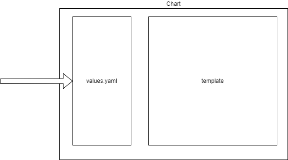

# Agenda
* Motivation
* The Problem!?
* Demo Kustomize
* Demo Kustomize with GitOps (Flux)
 
 
 
 
 
 
 
 
 
 
 
 
 
 
 
 
 
 
 
 
 
 
# Motivation
* Kubernetes on the Edge in a Manufactoring setting
* GitOps / Flux
* Repository structure that manage workloads and clusters (and more)
 
 
 
 
 
 
 
 
 
 
 
 
 
 
 
 
 
 
 
 
 
 
# What is Kustomize?

 
 
 
 
 
 
 
 
 
 
 
 
 
 
 
 
 
 
 
 
 
 
# Helm
